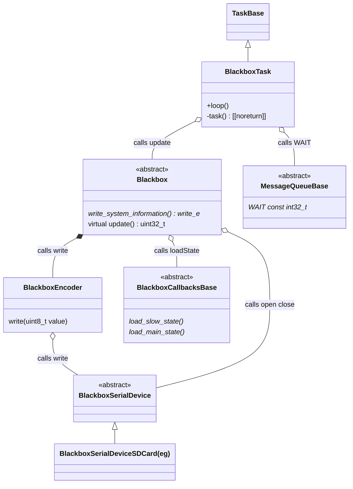

# Blackbox Library  

The Blackbox library is a port (modification) of the Blackbox implementation by Nicholas Sherlock (aka thenickdude),
see https://github.com/thenickdude/blackbox
It also contains Kustaa Nyholm's `printf` implementation.
This library is written C++. (The original was written in C).

The main changes in this library are:

1. Code has been converted to C++.
2. Dependencies (ie configs, features, sensors etc) have been removed and abstracted into callbacks,
   so this library can be used on its own.

## Notes on Blackbox tasks and scheduling

Betaflight uses non-preemptive cooperative scheduling. This means tasks undertake activities that
take a long time need to yield while undertaking those activities. Betaflight uses two common design patterns
to do this:

1. Splitting an activity into reasonable chunks and using a state machine to sequence through those chunks.
2. Making asynchronous calls to a function with a callback for when that function completes.

In Betaflight, Blackbox runs as a subtask of the MainPidLoop task, which typically runs at 8kHz. Blackbox
can be configured to run at a submultiple of that frequency (ie 4kHz, 2kHz, etc).

## Notes on the port

This is very much a "minimal effort" port - just enough work was done to get it working for ProtoFlight and SelfBalancingRobot.

This means the code is a curious mix of both my style and the original style. It is also a curious mix of C-like code and C++-like code.

## License Information

This library is a port (modification) of the Blackbox implementation by
[Nicholas Sherlock (aka thenickdude)](https://www.nicksherlock.com/),
[source code](https://github.com/thenickdude/blackbox).
This was licensed under the GNU GPL v3.

This library also contains Kustaa Nyholm's `printf` implementation, which is included under
the terms of its license and includes that implementation's copyright notice, conditions and disclaimer.

## Simplified Class Diagram

All writing to the serial device is done via the `BlackboxEncoder`

